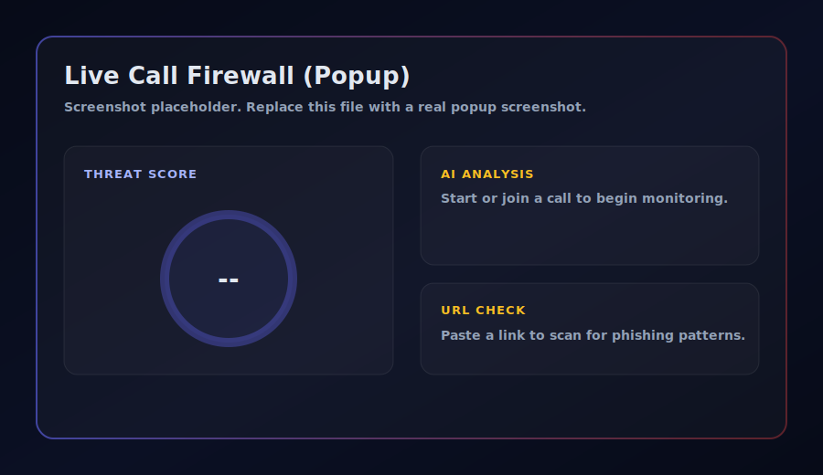
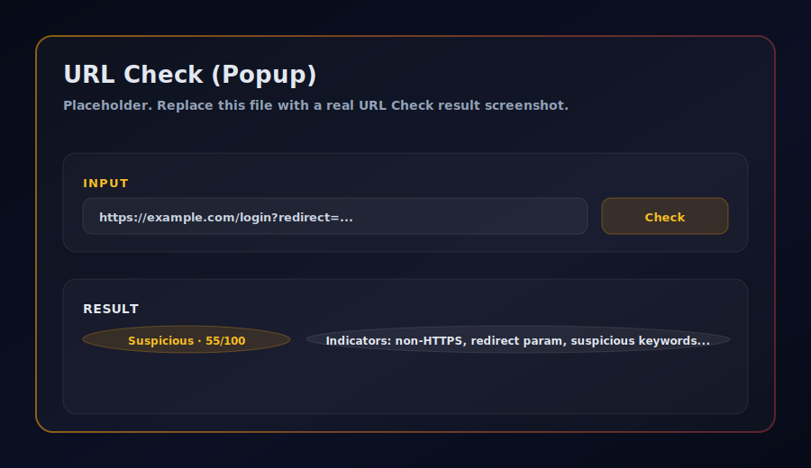
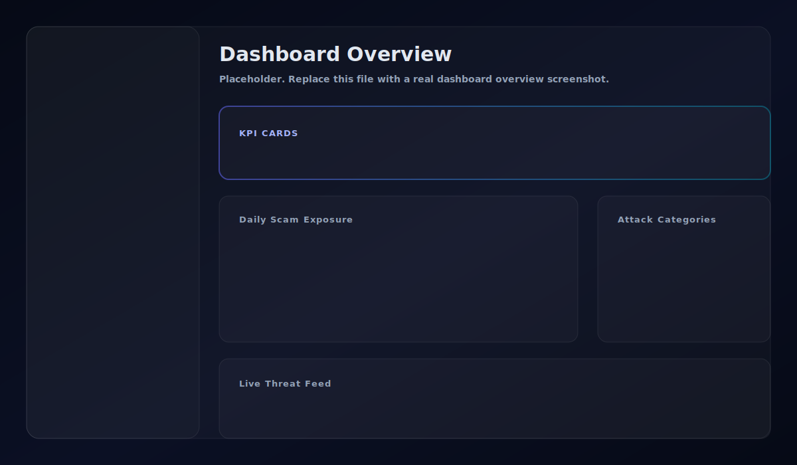
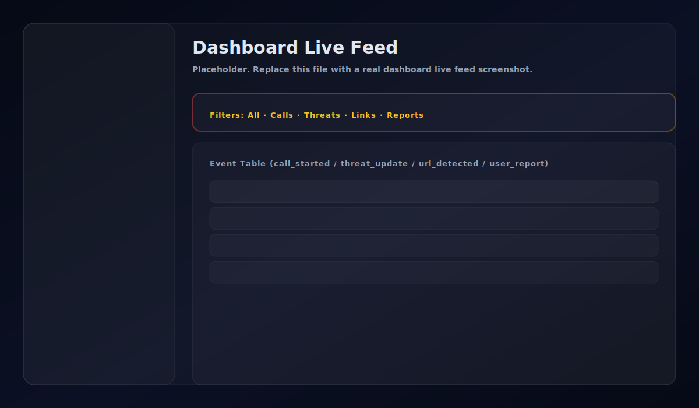
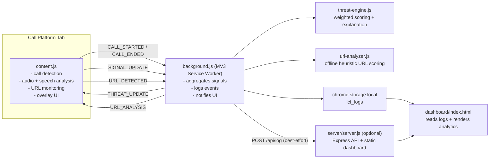

# Live Call Firewall

Live Call Firewall is a Chrome/Chromium MV3 extension that monitors supported video/audio call platforms for scam and social-engineering indicators, assigns a real-time threat score, and logs events to a dashboard.

It is designed to be **local-first**:

- Threat scoring runs in the browser.
- Logs are stored in `chrome.storage.local`.
- An optional local server (`http://localhost:3000`) enables the full dashboard experience and receives logs via an API.

## Features

- **Real-time threat score** (0-100) with an explainable summary.
- **Signal sources**
  - Behavioural: keyword-based social engineering cues from speech-to-text.
  - Voice: lightweight anomaly heuristics (synthetic voice indicators).
  - Links: offline heuristic **URL risk scoring** (safe/suspicious/malicious).
- **UI surfaces**
  - Extension popup with live score, "Open Dashboard", "Report", and **URL Check**.
  - In-page overlay on call tabs when risk is elevated.
  - Dashboard with live feed, analytics, and a threat map.

## Supported Platforms

- Google Meet (`meet.google.com`)
- Zoom (`*.zoom.us`)
- Microsoft Teams (`teams.microsoft.com`)
- WhatsApp Web (`web.whatsapp.com`)
- Cisco Webex (`*.webex.com`)

## Screenshots

The repository includes placeholder images. Replace them by overwriting files in [`docs/screenshots`](/docs/screenshots) with real screenshots (same file names).

- `docs/screenshots/popup.svg`
- `docs/screenshots/popup-url-check.svg`
- `docs/screenshots/dashboard-overview.svg`
- `docs/screenshots/dashboard-live-feed.svg`






## Architecture



For a deeper breakdown (message types, data model), see [`docs/ARCHITECTURE.md`](/docs/ARCHITECTURE.md).

### Threat Score Model

Threat score is a weighted aggregation of signal category scores (each 0-100):

- Behaviour: 0.45
- Voice: 0.30
- URL risk: 0.25

See [`threat-engine.js`](/threat-engine.js).

### URL Risk Scoring (Offline)

URL analysis is heuristic-based (no API keys required). Examples of indicators:

- Non-HTTPS links
- IP address hostnames
- Punycode lookalike domains (`xn--...`)
- Userinfo in URL (`user@host`)
- URL shorteners (destination hidden)
- Suspicious TLDs, excessive subdomains, heavy encoding, redirect parameters
- Phishing-like keywords in path/query, and certain keywords in domain

Verdicts:

- `safe` (score < 40)
- `suspicious` (40-79)
- `malicious` (80+)

See [`url-analyzer.js`](/url-analyzer.js).

## Installation (Unpacked Extension)

1. Open `chrome://extensions` (or Edge: `edge://extensions`).
2. Enable **Developer mode**.
3. Click **Load unpacked**.
4. Select the repository root folder (this folder).
5. Join a supported call platform tab.

Notes:

- You may need to allow microphone access for voice analysis.
- The extension uses MV3 and requires a Chromium-based browser.

## Using The Dashboard

### Option A: Built-in Dashboard (No Server)

Click **Open Dashboard** in the popup. If the local server is not running, it opens the built-in dashboard page inside the extension, reading logs from `chrome.storage.local`.

### Option B: Full Dashboard Server (Recommended)

From the repo root:

```powershell
cd server
npm install
npm start
```

Then open:

- `http://localhost:3000`

The extension will also POST events to `http://localhost:3000/api/log` when the server is reachable.

## URL Check (Manual Scan)

Open the extension popup and use **URL Check**:

- Paste one or more URLs
- Click **Check**
- The popup shows the highest-risk URL, verdict, score, and indicators

This is the same heuristic engine used for live link detection during calls.

## Reporting

The **Report** button in the popup:

- Opens the cybercrime reporting portal (`https://cybercrime.gov.in`)
- Saves a `user_report` event into the dashboard logs (so you have a record of what was reported)

## Troubleshooting

- **URL Check stuck on "Checking..."**
  - Reload the extension on `chrome://extensions`.
  - Click the extension's "Service worker" link and check console errors.
- **Dashboard charts missing in built-in dashboard**
  - MV3 blocks CDN scripts on extension pages. Run the local server for the full chart experience.
- **No call detected**
  - Make sure you're on a supported platform and in an actual meeting URL (not the platform homepage).
- **Voice analysis not updating**
  - Confirm microphone permissions are granted and not blocked by the browser.

## Project Structure

```text
.
|-- manifest.json
|-- background.js              # MV3 service worker (signal aggregation + logging)
|-- content.js                 # Content script (call detection + analyzers + overlay)
|-- threat-engine.js           # Threat score + explanations
|-- url-analyzer.js            # Heuristic URL risk scoring (offline)
|-- popup.html / popup.js      # Extension popup UI + URL Check
|-- dashboard/                 # Dashboard UI (works as extension page or via server)
|-- server/                    # Optional Express server for dashboard + API
|-- icons/                     # Extension icons
`-- docs/
    `-- screenshots/           # Place screenshots here for README rendering
```

## Privacy & Safety Notes

- This project is heuristic-based and cannot guarantee a URL or call is safe/malicious.
- Data stays local by default. If you run the local server, logs are sent to `http://localhost:3000` only.

## Permissions (Why They Are Needed)

From [`manifest.json`](/manifest.json):

- `storage`: store logs locally (`chrome.storage.local`).
- `notifications`: show alerts for suspicious/malicious links.
- `tabs` / `activeTab`: identify active call tabs and open the dashboard/report pages.
- `scripting`: reserved for future injection/workflows (overlay is via content script today).
- `tabCapture`: reserved for future media capture use cases (current voice analysis uses `getUserMedia` in the tab).

## License

MIT. See [`LICENSE`](/LICENSE).
