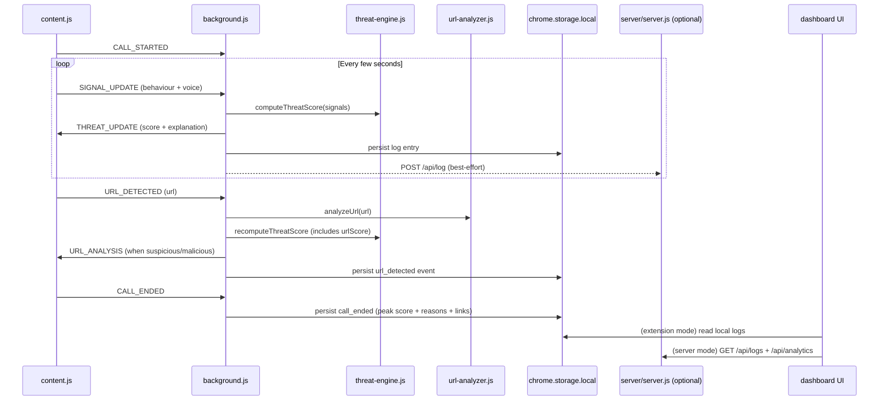

# Architecture

This document describes the high-level architecture, message flow, and data model for Live Call Firewall.

## Components

- **Content script** ([`content.js`](/content.js))
  - Detects whether a supported call is active (DOM heuristics per platform).
  - Captures microphone input (best-effort) and computes lightweight voice anomaly signals.
  - Runs speech-to-text (if supported) and performs keyword-based behavioural analysis.
  - Monitors the page for link sharing (DOM mutation observer + click capture) and reports URLs.
  - Renders an in-page overlay for elevated risk.

- **Background service worker** ([`background.js`](/background.js))
  - Receives signals and events from content scripts.
  - Scores URLs using the offline URL analyzer.
  - Aggregates signals and computes the overall threat score.
  - Stores logs locally and optionally POSTs them to the local dashboard server.
  - Broadcasts `THREAT_UPDATE` back to active call tabs.

- **Threat engine** ([`threat-engine.js`](/threat-engine.js))
  - Weighted threat score computation.
  - Explainable summary generation.
  - Confidence estimation.

- **URL analyzer** ([`url-analyzer.js`](/url-analyzer.js))
  - Offline heuristic URL scoring.
  - Normalization + redirect unwrapping (for common wrappers like `google.com/url?...`).

- **Dashboard UI** ([`dashboard/`](/dashboard))
  - Works in two modes:
    - As an extension page (reads logs from `chrome.storage.local`; uses fallback charts when CDN is blocked by MV3 CSP)
    - As a normal web page served from `http://localhost:3000` (Chart.js CDN works; reads logs from the server API)

- **Dashboard server (optional)** ([`server/server.js`](/server/server.js))
  - Express server serving the dashboard and accepting logs via `POST /api/log`.

## Message Flow

## Message Types (Background <-> Content)

- `CALL_STARTED`
  - `{ url }`
- `CALL_ENDED`
  - no payload
- `SIGNAL_UPDATE`
  - Behaviour:
    - `behaviourScore`
    - `behaviourDetails: { urgencyHits, authorityHits, financialHits, fearHits, linkShareHits }`
  - Voice:
    - `voiceScore`
    - `voiceDetails: { lowPitchVariance, waveformAnomaly, energySpike, energy }`
- `URL_DETECTED`
  - `{ url, source, pageUrl, timestamp }`
- `THREAT_UPDATE`
  - `{ threat }` (score, label, explanation, confidence, breakdown)
- `URL_ANALYSIS`
  - `{ analysis }` (verdict, score, reasons, hostname, signals)

## Logs

Background writes to:

- `chrome.storage.local` key: `lcf_logs`
- Optional server file: `server/logs.json`

Common log events:

- `call_started`
- `threat_update`
- `url_detected`
- `user_report`
- `call_ended`

## Notes / Limitations

- This is a heuristic system; it cannot guarantee maliciousness.
- Speech recognition depends on browser support (`SpeechRecognition` / `webkitSpeechRecognition`).
- Voice analysis uses microphone input; it may not reflect the remote caller's audio depending on how the call is routed.

